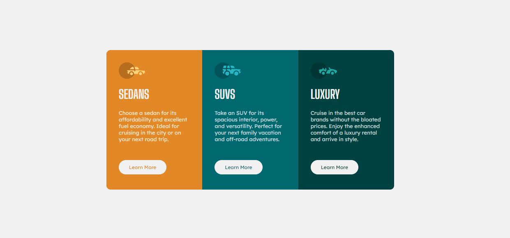

# Frontend Mentor - 3-column preview card component solution

This is a solution to the [3-column preview card component challenge on Frontend Mentor](https://www.frontendmentor.io/challenges/3column-preview-card-component-pH92eAR2-). Frontend Mentor challenges help you improve your coding skills by building realistic projects. 

## Table of contents

- [Overview](#overview)
  - [The challenge](#the-challenge)
  - [Desktop](#desktop)
  - [Mobile](#mobile)
  - [Links](#links)
  - [Built with](#built-with)

## Overview

### The challenge

Users should be able to:

- View the optimal layout depending on their device's screen size ✅
- See hover states for interactive elements ✅

### Desktop

 

### Mobile

 

### Links

- Solution URL: <a href="#" target="_blank">Frontend Mentor</a>
- Live Site URL: <a href="#" target="_blank">Github Pages</a>

## Built with

- Semantic HTML
- Flexbox
- Grid layout
